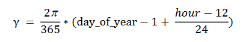
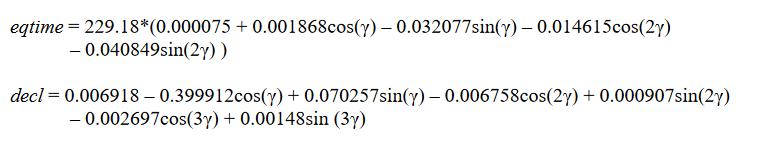
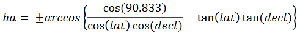
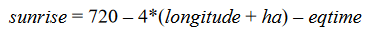

# night-light :bulb:
 An application for automatically turning on a smart bulb at sunset. 

# Sunset calculations
 To calculate the sunset at a given location on a given calender we can use [NOAA's General Solar Position Calculations.](https://gml.noaa.gov/grad/solcalc/solareqns.PDF) 

 The first step is to calculate the the fractional year (γ) in radians. This is done using the formula:

  \
 *Note: This equation uses 12-hour time. For out use case we can use 12am for the start of the day.* 

 Using the γ we can now estimate the equation of time (*eqtime*) in minutes  and solar declination angle (*decl*) in radians using the formulas below:

 

 Finlay we can calculate the hour angle (ha) when the solar zenith is 90.833° and then use all calculations to estimate the sunset time in minutes:

  \
  *Note: To calculate the sunset hour angle we use the negative vale.* 

  \
 *Note: This equation is the same for sunrise and sunset calculations.*
